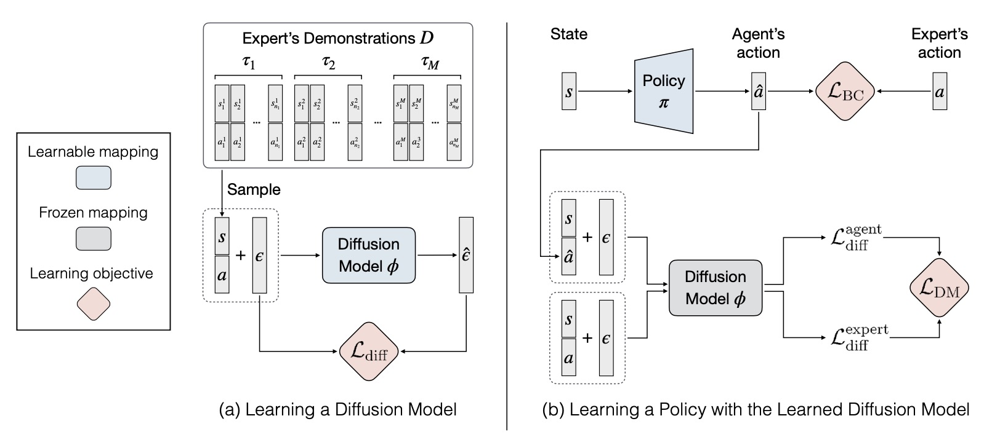

# Diffusion Model-Augmented Behavioral Cloning

[Shang-Fu Chen\*](https://shangfuchen.github.io/),
[Hsiang-Chun Wang\*](https://openreview.net/profile?id=~Hsiang-Chun_Wang1),
[Ming-Hao Hsu](https://qaz159qaz159.github.io/),
[Chun-Mao Lai](https://www.mecoli.net/),
[Shao-Hua Sun](https://shaohua0116.github.io) at [NTU RLL lab](https://nturll.xyz/about)

[[Project website]](https://nturobotlearninglab.github.io/DBC/) [[Paper]](https://arxiv.org/abs/2302.13335)

This is the official PyTorch implementation of the paper ["Diffusion Model-Augmented Behavioral Cloning"](https://nturobotlearninglab.github.io/DBC/) (ICML2024).



## Installation

1. This code base requires `Python 3.7.2` or higher. All package requirements are in
   `requirements.txt`. To install from scratch using Anaconda, use the following
   commands.

```
conda create -n [your_env_name] python=3.7.2
conda activate [your_env_name]
pip install -r requirements.txt

cd d4rl
pip install -e .
cd ../rl-toolkit
pip install -e .

mkdir -p data/trained_models
```

2. Setup [Weights and Biases](https://wandb.ai/site) by first logging in with `wandb login <YOUR_API_KEY>` and then editing `config.yaml` with your W&B username and project name.

```
python download_demos.py
```

## How to reproduce experiments
- For diffusion model pretraining, run `dbc/ddpm.py`.
- For policy learning, you can either run `dbc/main.py` for single experiment or run `wandb sweep configs/<env>/<alg.yaml>` to run a wandb sweep. 
- We have provided both methods to reproduce our result. Configuration files for policy learning of all tasks can be found at `configs`.

We specify how to train diffusion models and the location of configuration files as following:

### Maze2D

- Ours:
    1. DM pretraining: ` python dbc/ddpm.py --traj-load-path expert_datasets/maze.pt --num-epoch 8000 --lr 0.0001 --hidden-dim 128`
    2. Policy learning:
        - single experiment: `python dbc/main.py --alg dbc --bc-num-epochs 2000 --depth 3 --hidden-dim 256 --coeff 30 --coeff-bc 1 --ddpm-path data/dm/trained_models/maze_ddpm.pt --env-name maze2d-medium-v2 --lr 0.00005 --traj-load-path ./expert_datasets/maze.pt --seed 1`
        - To run a single experiment on other environments, please refer to the configuration files to see the parameters for each environment.
        - wandb sweep: `./wandb.sh ./configs/maze/dbc.yaml`
- BC: `./wandb.sh ./configs/maze/bc.yaml`

### Fetch Pick

- Ours:
    1. DM pretraining: `python dbc/ddpm.py --traj-load-path expert_datasets/pick.pt --num-epoch 10000 --lr 0.001 --hidden-dim 1024  `
    2. Policy learning: `./wandb.sh ./configs/fetchPick/dbc.yaml`
- BC: `./wandb.sh ./configs/fetchPick/bc.yaml`

### Hand Rotate

- Ours:
    1. DM pretraining: `python dbc/ddpm.py --traj-load-path expert_datasets/hand.pt --num-epoch 10000 --lr 0.00003 --hidden-dim 2048`
    2. Policy learning: `./wandb.sh ./configs/hand/dbc.yaml`
- BC: `./wandb.sh ./configs/hand/bc.yaml`

### Half Cheetah

- Ours:
    1. DM pretraining: `python dbc/ddpm.py --traj-load-path expert_datasets/halfcheetah.pt --num-epoch 8000 --lr 0.0002 --hidden-dim 1024`
    2. Policy learning: `./wandb.sh ./configs/halfcheetah/dbc.yaml`
- BC: `./wandb.sh ./configs/halfcheetah/bc.yaml`

### Walker

- Ours:
    1. DM pretraining: ` python dbc/ddpm.py --traj-load-path expert_datasets/walker.pt --num-epoch 8000 --lr 0.0002 --hidden-dim 1024`
    2. Policy learning: `./wandb.sh ./configs/walker/dbc.yaml`
- BC: `./wandb.sh ./configs/walker/bc.yaml`

### Ant Goal

- Ours:
    1. DM pretraining: `python dbc/ddpm.py --traj-load-path expert_datasets/ant.pt --num-epoch 20000 --lr 0.0002 --hidden-dim 1024 --norm False`
    2. Policy learning: `./wandb.sh ./configs/antReach/dbc.yaml`
- BC: `./wandb.sh ./configs/antReach/bc.yaml`

## Code Structure

- Methods:
  - `rl-toolkit/rlf/algos/il/dbc.py`: Algorithm of our method
  - `rl-toolkit/rlf/algos/il/bc.py`: Algorithm of BC
- Environments:
  - `d4rl/d4rl/pointmaze/maze_model.py`: Maze2D task
  - `dbc/envs/fetch/custom_fetch.py`: Fetch Pick task.
  - `dbc/envs/hand/manipulate.py`: Hand Rotate task.

## Acknowledgement
- This repo is based on the official PyTorch [implementation](https://github.com/clvrai/goal_prox_il) of the paper ["Generalizable Imitation Learning from Observation via Inferring Goal Proximity"](https://clvrai.github.io/goal_prox_il/)
- Base RL code and code for imitation learning baselines from [rl-toolkit](https://github.com/ASzot/rl-toolkit).
- The Maze2D environment is based on [D4RL: Datasets for Deep Data-Driven Reinforcement Learning](https://github.com/rail-berkeley/d4rl).(https://github.com/rail-berkeley/d4rl) for Maze2D.
- The Fetch and Hand Rotate environments are with some tweaking from [OpenAI](https://github.com/openai/gym/tree/6df1b994bae791667a556e193d2a215b8a1e397a/gym/envs/robotics)
- The [HalfCheetah](https://github.com/openai/gym/blob/master/gym/envs/mujoco/half_cheetah_v3.py) and the [Walker2d](https://github.com/openai/gym/blob/master/gym/envs/mujoco/walker2d_v3.py) environment is in OpenAI Gym.
- The Ant environment is with some tweaking from [DnC](https://github.com/dibyaghosh/dnc)

## Citation

```
@inproceedings{
    chen2024diffusion,
    title={Diffusion Model-Augmented Behavioral Cloning},
    author={Shang-Fu Chen and Hsiang-Chun Wang and Ming-Hao Hsu and Chun-Mao Lai and Shao-Hua Sun},
    booktitle={Forty-first International Conference on Machine Learning},
    year={2024},
    url={https://openreview.net/forum?id=OnidGtOhg3}
}
```