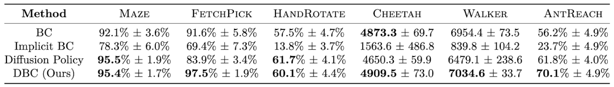
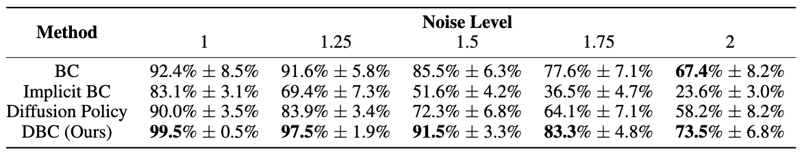

---

## Abstract

Imitation learning addresses the challenge of learning by observing an expert’s demonstrations without access to reward signals from environments. Most existing imitation learning methods that do not require interacting with environments either model the expert distribution as the conditional probability $$p(a|s)$$ (e.g., behavioral cloning, BC) or the joint probability $$p(s, a)$$. Despite the simplicity of modeling the conditional probability with BC, it usually struggles with generalization. While modeling the joint probability can improve generalization performance, the inference procedure is often time-consuming, and the model can suffer from manifold overfitting. This work proposes an imitation learning framework that benefits from modeling both the conditional and joint probability of the expert distribution. Our proposed diffusion model-augmented behavioral cloning (DBC) employs a diffusion model trained to model expert behaviors and learns a policy to optimize both the BC loss (conditional) and our proposed diffusion model loss (joint). DBC outperforms baselines in various continuous control tasks in navigation, robot arm manipulation, dexterous manipulation, and locomotion. We design additional experiments to verify the limitations of modeling either the conditional probability or the joint probability of the expert distribution, as well as compare different generative models. Ablation studies justify the effectiveness of our design choices.

----

## Framework Overview 


Our proposed method DBC augments behavioral cloning (BC) by employing a diffusion model.
**(a) Learning a Diffusion Model:** The diffusion model $$\phi$$ learns to model the distribution of concatenated state-action pairs sampled from the demonstration dataset $$D$$. It learns to reverse the diffusion process (i.e. denoise) by optimizing $$L_{diff}$$.
**(b) Learning a Policy with the Learned Diffusion Model:** We propose a diffusion model objective $$L_{DM}$$ for policy learning and jointly optimize it with the BC objective $$L_{BC}$$. Specifically, $$L_{DM}$$ is computed based on processing a sampled state-action pair $$(s, a)$$ and a state-action pair $$(s, \hat{a})$$ with the action $$\hat{a}$$ predicted by the policy $$\pi$$ with $$L_{diff}$$.

----

## Environments & Tasks


**(a) Maze:** A point-mass agent (<span style="color:green">green</span>) in a 2D maze learns to navigate from its start location to a goal location (<span style="color:red">red</span>).
**(b) FetchPick:** The robot arm manipulation tasks employ a 7-DoF Fetch robotics arm to pick up an object (<span style="color:#c2c20c">yellow</span> cube) from the table and move it to a target location (<span style="color:red">red</span>).
**(c) HandRotate:** This dexterous manipulation task requires a Shadow Dexterous Hand to in-hand rotate a block to a target orientation. 
**(d)-(e) Cheetah and Walker:** These locomotion tasks require learning agents to walk as fast as possible while maintaining their balance.
**(f) AntReach:** This task combines locomotion and navigation, instructing an ant robot with four legs to reach the goal location while maintaining balance.

----

## Quantitative Results

We report the mean and the standard deviation of success rate (Maze, FetchPick, HandRotate, AntReach) and return (Cheetah, Walker), evaluated over three random seeds. Our proposed method (DBC) outperforms or performs competitively against the best baseline over all environments.




----


## Qualitative Results

Rendered videos of the policies learned by our proposed framework (DBC) and the baselines. (<span style="color:green">green</span>: succeed; <span style="color:red">red</span>: fail)


----

## Generalization Experiments

We report the performance of our proposed framework DBC and the baselines regarding the mean and the standard deviation of the success rate with different levels of noise injected into the initial state and goal locations in FetchPick, evaluated over three random seeds.




----

## Ablation Study

We compare using different generative models to model the expert distribution and guide policy learning in Maze. With or without the BC loss, the diffusion model-guided policy achieves the best performance compared to other generative models.


----

## Citation
```
@article{wang2023diffusion,
  title={Diffusion Model-Augmented Behavioral Cloning},
  author={Hsiang-Chun Wang and Shang-Fu Chen and Ming-Hao Hsu and Chun-Mao Lai and Shao-Hua Sun},
  journal={arXiv preprint arXiv:2302.13335},
  year={2023}
}
```
<br>
